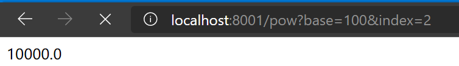

# SEDA Web framework.Server
**Maintainer: Zhu Wenjie**
## 定义Definition
**SEDA**(Staged framework.Event Driven Architecture) is an asynchronous and pipelined server model.  
Each Stage is composed of an event queue and a thread pool.  
A thread will handle a batch of events, and produce new events.  
SEDA is now applied in Cassandra.   
SEDA(分阶段事件驱动模型)是一个异步流水线服务器模型  
每个阶段由一个事件队列和一个线程池组成  
线程将会对事件进行批处理并制造新的事件到其他阶段   
目前Cassandra中运用了SEDA服务器模型

## 运行QuickStart
- Run server and use your browser to visit localhost:8001 直接访问浏览器,进行http交互
- Run server and run multiple client 通过提供的client进行tcp交互

## 实现Implementation
Now, my implementation simplify the controller of thread and batch, so that the thread pool size and batch size are fixed instead of dynamic.  
Main/Sub Reactor and NIO(IO multiplexing) is the IO model, which means getting request is synchronous but handling request is asynchronous and pipelined.   
Main Reactor use one selector for Accept, Sub Reactor use another for IO. To register the socket to Sub Reactor, timeout is necessary to avoid blocking.   
目前我的实现简化了论文中关于线程和批处理的控制器，单纯使用定值。  
IO模型是**主从Reactor**+多路复用，接收请求的数据是同步的，而处理请求并发送响应则是异步且流水线化的。  
使用两个Selector分别负责accept和io，为了避免main注册sub时sub被select阻塞，因此设定timeout为100ms。  
### EventLoop
- Acceptable: 获取channel并注册在sub Reactor上
- Readable: 获取数据并发送事件给Read stage，如果长度-1则进行close，close channel且cancel key
- Writable: 停止监听Writable并发送事件给Flush Stage
- Connectable: not supported
### Read Stage
读取请求并读取header的第一行，获取请求类型、url，转发给AppStage
### App Stage
对于url进行parse，然后根据路径、请求类型到dispatcher中寻找对应的函数入口，并使用参数进行调用，并将调用结果通过事件转发给WriteStage  
如果参数不足,则返回Parameter not Found
### Write Stage
增加响应头，填充响应体,将响应写入socket缓冲区，并监听writable事件
### Flush Stage
刷新socket缓冲区

## 演示DEMO
Now It only support Pow and Add，by visit /pow?base={base}&index={index} and /add?left={left}&right={right}  
目前仅支持Restful格式的幂运算和加法，结果在返回的html中，非法地址将会返回错误信息。

## 计划表RoadMap
- 除了目前的read write之外，accept和connect也进行异步化(目前没有connect)
- 支持Http状态机(目前默认一次收整个http包)
- 支持类似Spring的Controller自动注册(啊这，没有Bean不知道咋整)
- 更多应用层协议支持
- 提供长连接功能

## Version版本
- 0.0 TCP server with staged event driven architecture and single Reactor
- 0.1 Http server with basic Restful support, main/sub Reactor
- 0.2 Add Flush Stage with async NIO write support

## Issue问题
问题在于，假如我上次的事件还没有处理完成，因为NIO默认水平触发，那这个key还是活跃的。那会不会让channel重复消费这个key呢?    
举个例子，我0ms监听到key事件，每100ms监听一次，而处理需要1s，1s之内这个key都是活跃的，那样的话难道要read 10次么。   
目前我使用同步读取来暂时规避这个问题，可能使用边缘触发能够防止这种情况?   

## 参考Reference
[System|网络|分阶段事件驱动架构SEDA](https://zhuanlan.zhihu.com/p/161902784 )   
[SEDA: an architecture for well-conditioned, scalable internet services](https://dl.acm.org/doi/abs/10.1145/502034.502057)
